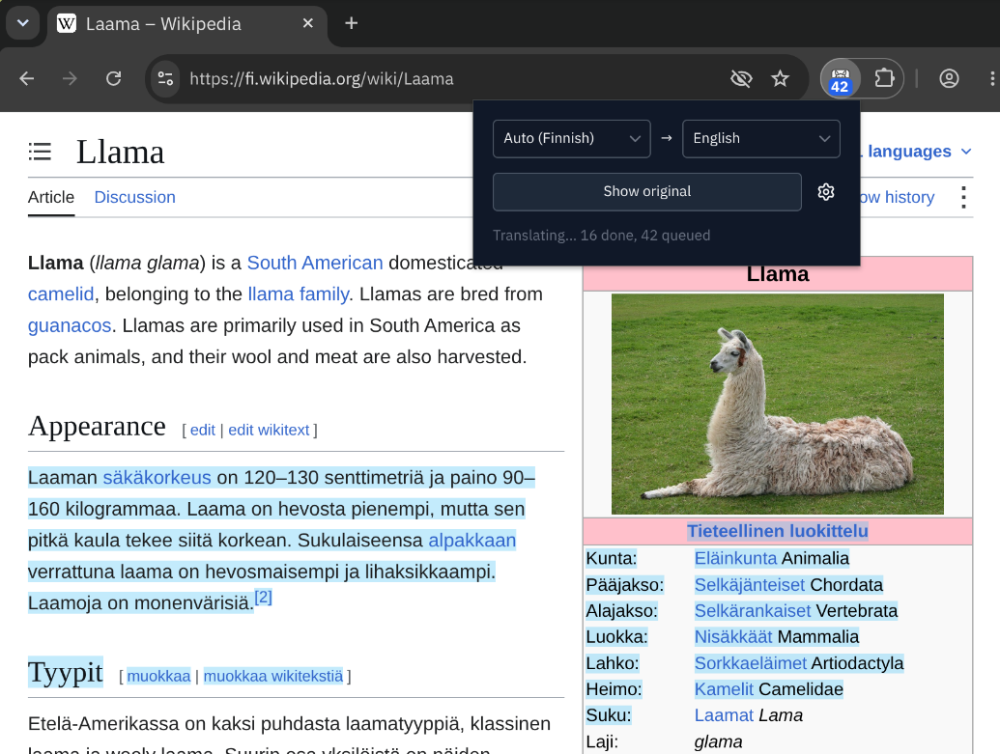

# Llama Franca

Translate web pages in your browser with a local LLM on Ollama. Just like lingua franca, but llama.



## Features

- **Private and free**: pages are translated by your own Ollama server. No account, no API key, nothing leaves your machine.
- **Ready for TranslateGemma**: the default model and prompt are set up for [TranslateGemma](https://ollama.com/library/translategemma), an open model built for translation that keeps links and formatting in place.
- **Translate the whole page in place**, from the toolbar or the right-click menu. Links and formatting stay intact, and _Show original_ brings the page back.
- **Translate a selection**: right-click selected text to read its translation in a popover.
- **Detects the language for you**, per page and per paragraph, and leaves text already in your language alone.
- **What you're reading comes first**: text translates as it scrolls into view, main content before menus and sidebars.
- **Keeps up as you browse**: content that loads later, like infinite scroll, is translated too, and the tab stays translated across pages on the same site.
- **Instant on revisit**: translations are cached locally, up to 8 MB by default.
- **Shows its progress**: text being translated is tinted, and a badge on the toolbar icon counts what's left.
- **Make it yours**: pick any other installed Ollama model, edit the prompt, or change the cache size in _Settings_ (the gear icon in the popup).

## Tech stack

- [WXT](https://wxt.dev) (Manifest V3) with [Svelte 5](https://svelte.dev) and [Tailwind CSS v4](https://tailwindcss.com)
- [Ollama](https://ollama.com) running [TranslateGemma](https://ollama.com/library/translategemma) (`translategemma:4b` by default)
- TypeScript, [Vitest](https://vitest.dev) + happy-dom
- [oxlint](https://oxc.rs/docs/guide/usage/linter) and [oxfmt](https://oxc.rs/docs/guide/usage/formatter), run on commit via simple-git-hooks + lint-staged

## How to

### Set up Ollama

1. Install [Ollama](https://ollama.com/download) and pull the model:

   ```sh
   ollama pull translategemma:4b
   ```

   Any other installed model can be picked in _Settings_, but TranslateGemma is recommended: the default prompt is written for it, and other models may drop links and formatting.

2. Allow requests from the extension by setting `OLLAMA_ORIGINS` for the Ollama server, then restart it:

   ```sh
   OLLAMA_ORIGINS="chrome-extension://*" ollama serve
   ```

   Use `moz-extension://*` for Firefox. The extension expects Ollama at `http://localhost:11434`.

   Optionally set `OLLAMA_NUM_PARALLEL=2` too, so the extension's two concurrent requests run in parallel instead of queueing. Each extra slot only adds its context memory, the model weights are shared.

### Run in development

```sh
pnpm install
pnpm dev          # Chromium
pnpm dev:firefox  # Firefox
```

This opens a browser with the extension loaded and reloads it on changes. To use a specific browser binary, create a `web-ext.config.ts` (gitignored):

```ts
import { defineWebExtConfig } from "wxt";

export default defineWebExtConfig({
  binaries: { chrome: "/path/to/browser" },
});
```

### Build and install

```sh
pnpm build          # all of the below
pnpm build:chrome   # → dist/chrome-mv3 (Chrome, Edge, Brave, Opera, and other Chromium browsers)
pnpm build:firefox  # → dist/firefox-mv2
pnpm build:safari   # → dist/safari-mv2
```

In a Chromium browser, open `chrome://extensions`, enable _Developer mode_, and _Load unpacked_ the `dist/chrome-mv3` folder.

In Firefox, open `about:debugging#/runtime/this-firefox`, click _Load Temporary Add-on…_, and select `dist/firefox-mv2/manifest.json`. It stays loaded until Firefox restarts. To keep it installed, set `xpinstall.signatures.required` to `false` in `about:config` (Developer Edition, Nightly, or ESR only), run `pnpm zip:firefox`, and install the zip from `about:addons` → gear icon → _Install Add-on From File…_.

The Safari build must be converted into an Xcode project on macOS with `xcrun safari-web-extension-packager dist/safari-mv2` before it can be installed.

> Tested on Chromium and Firefox. The Safari build is untested.

### Check

```sh
pnpm check     # svelte-check
pnpm lint      # oxlint
pnpm fmt:check # oxfmt
pnpm test      # vitest
```

---

Not affiliated with [Ollama](https://ollama.com).
