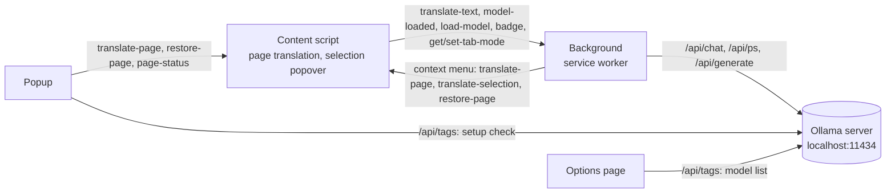
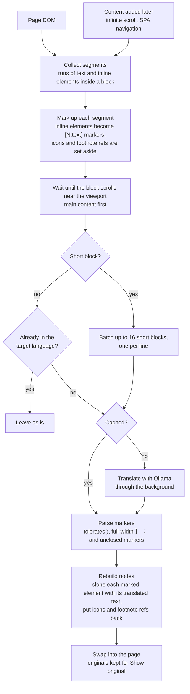

# Llama Franca

Translate web pages in your browser with a local LLM on Ollama. Just like lingua franca, but llama.


<!-- START doctoc generated TOC please keep comment here to allow auto update -->
<!-- DON'T EDIT THIS SECTION, INSTEAD RE-RUN doctoc TO UPDATE -->

**Contents**

- [Features](#features)
- [Usage](#usage)
  - [Set up Ollama](#set-up-ollama)
  - [Build and install](#build-and-install)
  - [Memory use and speed](#memory-use-and-speed)
- [How it works](#how-it-works)
  - [Entrypoints and messaging](#entrypoints-and-messaging)
  - [Page translation](#page-translation)
- [Development](#development)
  - [Start dev environment](#start-dev-environment)
  - [Check, lint, and test](#check-lint-and-test)

<!-- END doctoc -->

## Features

- **Private and free**: pages are translated by your own Ollama server. No account, no API key, nothing leaves your machine.
- **Ready for TranslateGemma**: the default model and prompt are set up for [TranslateGemma](https://ollama.com/library/translategemma), an open model built for translation that keeps links and formatting in place.
- **Translate the whole page in place**, from the toolbar or the right-click menu. Links and formatting stay intact, and _Show original_ brings the page back.
- **Translate a selection**: right-click selected text to read its translation in a popover.
- **Detects the language for you**, per page and per paragraph, and leaves text already in your language alone.
- **What you're reading comes first**: text translates as it scrolls into view, main content before menus and sidebars.
- **Keeps up as you browse**: content that loads later, like infinite scroll, is translated too, and the tab stays translated across pages on the same site.
- **Instant on revisit**: translations are cached locally, up to 8 MB by default.
- **Shows its progress**: text being translated is tinted, and a badge on the toolbar icon counts what's left.
- **Make it yours**: pick any other installed Ollama model, edit the prompt, or change the cache size in _Settings_ (the gear icon in the popup).

## Usage

### Set up Ollama

1. Install [Ollama](https://ollama.com/download) and pull the model:

   ```sh
   ollama pull translategemma:4b
   ```

   Any other installed model can be picked in _Settings_, but TranslateGemma is recommended: the default prompt is written for it, and other models may drop links and formatting.

2. Allow requests from the extension by setting `OLLAMA_ORIGINS` for the Ollama server, then restart it:

   ```sh
   OLLAMA_ORIGINS="chrome-extension://*" ollama serve
   ```

   Use `moz-extension://*` for Firefox. The extension expects Ollama at `http://localhost:11434`.

   Optionally set `OLLAMA_NUM_PARALLEL=2` too, so the extension's two concurrent requests run in parallel instead of queueing. Each extra slot only adds its context memory, the model weights are shared.

### Build and install

Requires [pnpm](https://pnpm.io/installation). Run `pnpm install` first, then:

```sh
pnpm build          # all of the below
pnpm build:chrome   # → dist/chrome-mv3 (Chrome, Edge, Brave, Opera, and other Chromium browsers)
pnpm build:firefox  # → dist/firefox-mv2
pnpm build:safari   # → dist/safari-mv2
```

In a Chromium browser, open `chrome://extensions`, enable _Developer mode_, and _Load unpacked_ the `dist/chrome-mv3` folder.

In Firefox, open `about:debugging#/runtime/this-firefox`, click _Load Temporary Add-on…_, and select `dist/firefox-mv2/manifest.json`. It stays loaded until Firefox restarts. To keep it installed, set `xpinstall.signatures.required` to `false` in `about:config` (Developer Edition, Nightly, or ESR only), run `pnpm zip:firefox`, and install the zip from `about:addons` → gear icon → _Install Add-on From File…_.

The Safari build must be converted into an Xcode project on macOS with `xcrun safari-web-extension-packager dist/safari-mv2` before it can be installed.

> Tested on Chromium and Firefox. The Safari build is untested.

### Memory use and speed

For example, `translategemma:4b` (4.3B parameters, Q4_K_M) with `OLLAMA_NUM_PARALLEL=2` and `OLLAMA_FLASH_ATTENTION=1` takes 3.1 GB of VRAM with a 4096-token context, and runs fully on an NVIDIA GeForce RTX 3050 6GB Laptop GPU. It generates about 41 tokens/s for one request, or about 39 tokens/s each (77 combined) for two in parallel, enough for a paragraph in 2–3 seconds. Run `ollama ps` while translating to see the numbers on your machine.

## How it works

### Entrypoints and messaging



The content script is injected on demand, by the popup or the context menu, and again on each page load while a tab is translating. It never calls Ollama itself: it runs in the web page, so its requests carry the website's origin, which `OLLAMA_ORIGINS` doesn't allow. The popup, options page, and background are extension pages, so their requests carry the extension's origin and can call Ollama directly.

Settings and the translation cache live in `storage.local`, shared by all of them. The background keeps each tab's translating mode in `storage.session`.

### Page translation



A segment is a run of text and inline elements (links, bold, code…) inside one block. A run that's a single element, like a menu link, is translated inside that element without a marker. If the model returns a different number of lines for a batch, each block falls back to its own request. If it drops a marker, the words stay but the element is lost.

For example, this paragraph from Finnish Wikipedia, translated to English by `translategemma:4b`:

1. Original:

   ```html
   <p>
     Laaman lähin sukulainen on <a href="/wiki/Alpakka">alpakka</a>, ja molemmat polveutuvat
     <a href="/wiki/Guanako">guanakosta</a>.<sup>[1]</sup>
   </p>
   ```

2. Sent to the model, with the footnote set aside:

   ```text
   Laaman lähin sukulainen on [1:alpakka], ja molemmat polveutuvat [2:guanakosta].
   ```

3. Model output:

   ```text
   The closest relative of the llama is the [1:alpaca], and both species are descended from the [2:guanaco].
   ```

4. Rebuilt, with the footnote back after the link it followed:

   ```html
   <p>
     The closest relative of the llama is the <a href="/wiki/Alpakka">alpaca</a>, and both species
     are descended from the <a href="/wiki/Guanako">guanaco</a><sup>[1]</sup>.
   </p>
   ```

## Development

Built with [WXT](https://wxt.dev) (Manifest V3), [Svelte 5](https://svelte.dev), and [Tailwind CSS v4](https://tailwindcss.com), in TypeScript.

### Start dev environment

```sh
pnpm install
pnpm dev          # Chromium
pnpm dev:firefox  # Firefox
```

This opens a browser with the extension loaded and reloads it on changes. To use a specific browser binary, create a `web-ext.config.ts` (gitignored):

```ts
import { defineWebExtConfig } from "wxt";

export default defineWebExtConfig({
  binaries: { chrome: "/path/to/browser" },
});
```

### Check, lint, and test

Linting and formatting use [oxlint](https://oxc.rs/docs/guide/usage/linter) and [oxfmt](https://oxc.rs/docs/guide/usage/formatter). `pnpm install` sets up a pre-commit hook that runs both on staged files, and regenerates this README's table of contents with [doctoc](https://github.com/thlorenz/doctoc) (`pnpm toc` to run it by hand).

```sh
pnpm check     # svelte-check
pnpm lint      # oxlint
pnpm fmt:check # oxfmt
pnpm test      # vitest
```

---

Not affiliated with [Ollama](https://ollama.com).
